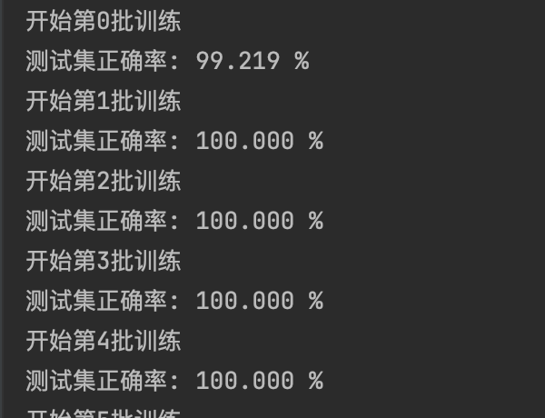

# CalculateCaptcha_Recognition
使用pytorch训练和识别计算验证码

#pytorch验证码识别
## 1.环境配置
下载代码
```bash
git clone https://github.com/fupinglee/CalculateCaptcha_Recognition
```
安装依赖
```bash
cd CalculateCaptcha_Recognition
pip install -r requirements_gpu.txt # gpu环境 
```
>如果没有GPU环境的话使用`pip install -r requirements.txt`
## 2.样本生成

https://github.com/fupinglee/Calculate_Captcha/releases

> 有两个版本，v1.0是老版本的验证码生成，v1.1是新版本验证码的生成，差别不是很大。
>可以两种验证码都生成一些，然后合并训练，也可以只要一种，识别率96%以上。


生成训练验和测试证码，这里训练验证码2000张，测试200张

```
java -jar  CalculateCaptcha.jar -n 2000 -p train
java -jar  CalculateCaptcha.jar -n 200 -p test
```
然后将`datasets`放在`CalculateCaptcha_Recognition`目录下


## 3.训练

```bash
python3 train.py
```


> 可以用GPU训练，没条件就CPU训练，耗时不会太多。
> 刚开始训练正确率很快就能达到100%

## 4.识别测试

```bash
python3 test.py
```
批量测试

```python
test()
```

单个样本测试
```python
test_pic('datasets/test/xxxx.jpg')
```

网络下载新的验证码进行验证
```python
test_net("http://demo.ruoyi.vip/captcha/captchaImage?type=math&s=0.39236748354325024")
```

## 5.pytorch模型转换为onnx

```bash
python to_onnx.py
```
参考[将PyTorch模型转换为ONNX](https://docs.microsoft.com/zh-cn/windows/ai/windows-ml/tutorials/pytorch-convert-model)

然后使用onnx进行验证码识别

```python
if __name__ == '__main__':
    path = "datasets/test/0+8=？_69146590872302eb7f65d52074da94a7.jpg"
    onnxFile = 'mathcode.onnx'

    img = Image.open(path)
    trans = transforms.Compose([
        transforms.Resize((60, 160)),
        # transforms.Grayscale(),
        transforms.ToTensor()
    ])
    img_tensor = trans(img)
    img_tensor = img_tensor.reshape(1, 3, 60, 160)  # 1张图片 1 灰色
    ort_session = onnxruntime.InferenceSession(onnxFile)

    modelInputName = ort_session.get_inputs()[0].name
    # onnx 网络输出
    onnx_out = ort_session.run(None, {modelInputName: to_numpy(img_tensor)})
    onnx_out = torch.tensor(np.array(onnx_out))
    onnx_out = onnx_out.view(-1, common.captcha_array.__len__())
    print(vec2Text(onnx_out))
```
执行`python onnx_test.py`

